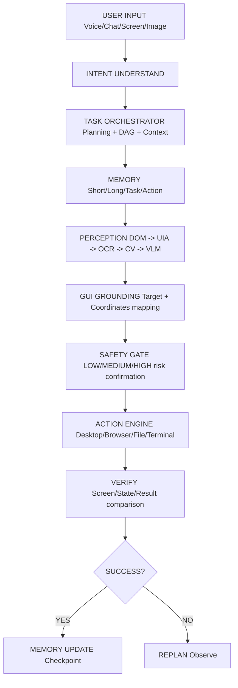

# Final System Architecture — CognitiveOS

This document specifies the modular boundaries and systems flow topology of CognitiveOS.

---

## 1. System Topology Map

---

## 2. Interface Definitions

* **Task Bridge:** Formulates dependency graphs and serializes checklists to JSON logs to prevent prompt overflow.
* **Perception Pipeline:** Combines DOM selectors, Windows Accessibility DFS traversals, local EasyOCR word match arrays, and OpenCV shape segmentation.

---

## 3. The 20+ Swarm Architecture (Mixture of Experts)
To achieve OpenAI-level capabilities, the system utilizes a Swarm of >20 specialized agents:
* **The Master Orchestrator:** Routes intents to the correct expert.
* **The Self-Healing Team:** A sub-swarm consisting of the *Vision QA Agent* (detects UI bugs visually), the *Logic Agent* (rewrites code), and the *Security Agent* (audits the fix).
* **The Web Security Bypass Agent:** Specialized in safely navigating Captchas and browser bot-detection.
* **The Auto-Deployment Agent (CI/CD):** Pushes automatic upgrades to clients (PlayStore, Web) via automated PRs and build pipelines.

---

## 4. SaaS Multi-Tenant Billing & Client Settings
The system supports 5 Tiers: SuperAdmin, Admin/Dev, Business, Pro, and Free.
* **Client MCP Panel:** Clients will have their own dashboard (like Antigravity) to configure their personal MCPs (their own GitHub, their own Unity workspace) without exposing global admin variables.
* **Token Limit Ledger:**
  * **Free:** Strictly rate-limited via FastAPI Token bucket middleware.
  * **Paid Tiers:** Unlocked dynamically via Stripe Webhooks (tracked in MongoDB).
  * **Admins:** Infinite local override capabilities.
