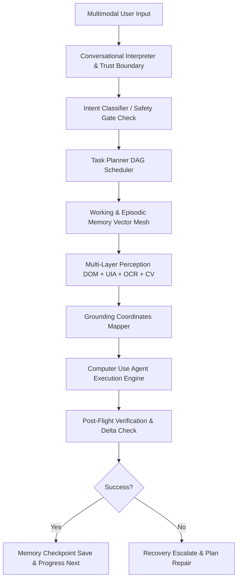

# JARVIS Next-Generation Target Architecture

This document describes the unified target topology for the JARVIS v1.1 modular mesh, resolving legacy duplicates and outlining the long-horizon autonomous flow.

---

## 1. Unified Modular Mesh Topology

---

## 2. Refactoring Directives (v1.1 Evolution)

### A. Core Cognition Nexus
- **Memory Mesh:** Abstract vector memory using a local ONNX embeddings transformer engine rather than direct API connections.
- **Safety Kernel:** Ensure `safety_layer.py` is called uniformly from both local model routing loops and high-risk intent dispatchers.

### B. Obsolete Module Cleanup
- Eliminate `backend/src/ai/precog_engine.py` and fold log-auditing into `core/reliability/experience_engine.py`.
- Re-route consciousness state queries directly into the RAG-backed `episodic_memory`.
